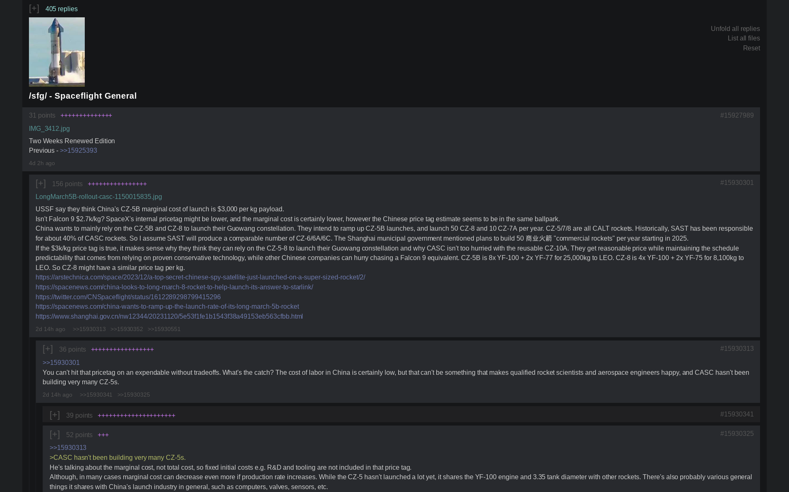
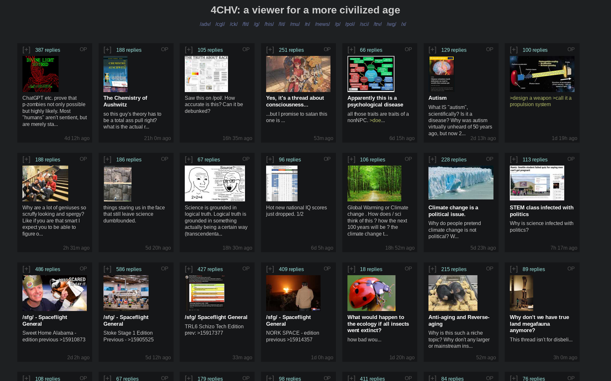

# 4CHV

A 4chan downloader/viewer for a more civilized age. Downloads threads and builds offline html pages for a /comfy/ browsing experience.

- Catalog view, nested replies
- Threads and replies are assigned points and sorted based on quality
- Tiny download size (1MB)


# Run on Windows

1. Have [Python](https://www.python.org/downloads/) installed
2. [Download this project](https://github.com/Infinitifall/4chv/archive/refs/heads/main.zip) and unzip the folder
3. Double click on `run_on_windows.bat`


# Run on Linux/macOS/BSD

```bash
git clone https://github.com/Infinitifall/4chv
cd 4chv
./run_on_linux.sh
```


# Screenshots






# FAQs

### How do I use this app?

  First follow the "run" instructions given above. You can keep this app running in the background and it'll keep downloading threads and updating html pages. You can open any of the html files in your browser to browse 4chv.

### How do I add/remove boards?

  Edit the `boards.txt` file and add one board per line.

### Why is downloading so slow?

  A new thread is downloaded every 2 seconds to stay within 4chan's api rate limit. Unfortunately this means you will have to wait a few minutes the very first time you run this app to see a good number of threads.

### What are points? What is the "++++" on every post? How is quality calculated?
  
  A post's quality is calculated in terms of points. The points a post gets depends on its words - unique words give higher points, common words give lower points. High quality replies to a post give it "+" points, which are shown separately as "++++" at the top of every post.

  Threads and replies are sorted on the basis of their points and the amount and quality of discussion they generate. This means high quality posts are on top while low quality replies are at the bottom and minimized by default.

### How do I uninstall this?

  Simply delete the folder, everything is contained within.


