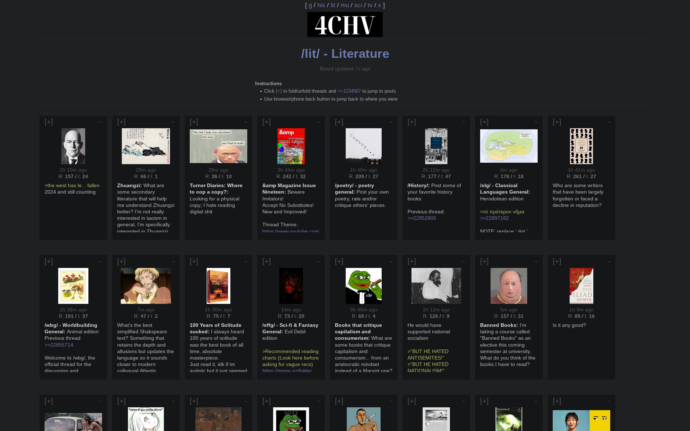

# 4CHV

A 4chan downloader/viewer for a more civilized age. Builds offline html pages for a /comfy/ browsing experience.

- Threads and posts are assigned points based on quality
- High quality posts on top, low quality replies hidden
- Catalog view, nested replies
- Highly minimal


## Installation for Windows

1. Install Python if you haven't already from [here](https://www.python.org/downloads/)

2. [Download this project](https://github.com/Infinitifall/4chv/archive/refs/heads/main.zip) and unzip the folder

3. Edit `boards.txt` and with the boards you want, one board per line

4. Double click on the `run.py` file to start the program

This will start downloading threads and creating html files which you can open in your browser. New threads are downloaded every two seconds, so you'll have to wait a minute the first time.


## Screenshots





## Installation for Linux

```bash
git clone https://github.com/Infinitifall/4chv
cd 4chv

# edit boards.txt with the boards you want, one board per line

# run 
python run.py
```

## Advanced usage

```bash
# download only threads from /g/, one every 5 seconds
python scripts/download.py "g" 5

# only build sci.html with the latest 300 posts, every 10 seconds
python scripts/view.html "sci" 300 10
```
