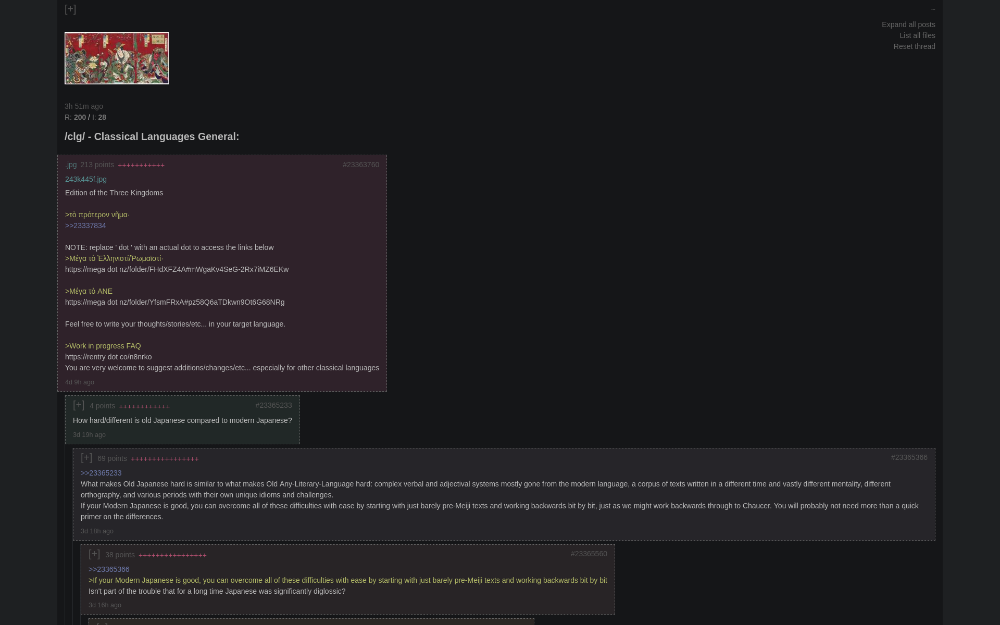

# 4CHV

A 4chan downloader/viewer. Downloads threads and builds offline HTML pages for a /comfy/ browsing experience.

- Catalog view with nested replies
- Threads and posts ordered by quality
- Keyboard shortcuts
- Tiny download size (1MB)


## Install

- **Windows (without Git)**
  1. Have [Python](https://www.python.org/downloads/) installed (can check by running `python --version` in cmd)
  2. Download the [latest version of 4CHV](https://github.com/Infinitifall/4chv/archive/refs/heads/main.zip) and unzip
  3. Double click to run `run_on_windows.bat`


- **Linux/BSD/macOS**

  ```bash
  # clone repo
  git clone https://github.com/Infinitifall/4chv
  cd 4chv

  # run
  ./run_on_linux.sh
  ```


## Screenshots





## Usage

- 4CHV can be kept running continuously, intermittently, or whenever you wish. While running,
  - Threads are downloaded every few seconds
  - HTML files are created/updated every few minutes and placed in `html/` (open in web browser)

- Select boards to download and other options by editing the config file [`chv_config.py`](./main/chv_config.py). Restart for changes to take effect.


## Files

- `html/`: Board HTML files
  - `resources/`: CSS, JS, image files
  - `thumbs/`: Thread thumbnails in `.png` format
- `threads/`: Threads stored in SQLite files
- `main/`
  - `chv_download.py`: Download threads
  - `chv_view.py`: Create HTML files
  - `chv_database.py`: Functions for SQLite db
  - `chv_run.py`: Run 4chv
  - `chv_config.py`: Config file


## FAQs

- **What is thread, post quality?**

  Threads and replies are ordered by "quality"
    - `points` measure the uniqueness of words used in a post
    - `+` measure the quality of the replies to a post (recursively measures points)


- **How to delete all downloaded threads, thumbnails?**
  - Stop 4chv if it is running
  - Delete the folders:
    - `threads/`
    - `html/thumbs/`


- **How to uninstall 4CHV?**

  Delete the entire `4chv/` folder
