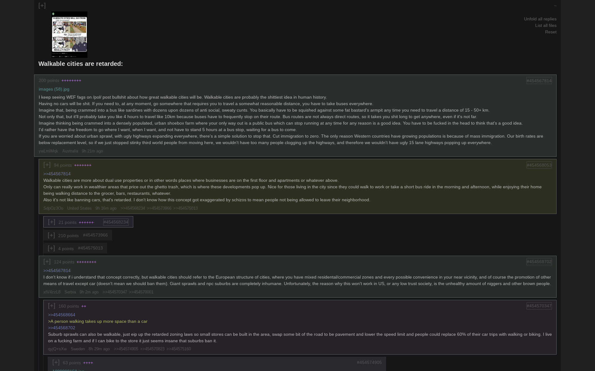

# 4CHV

A 4chan downloader/viewer for a more civilized age.

Downloads threads and builds offline html pages for a /comfy/ browsing experience.

- Catalog view
- Nested reply threads
- Threads and posts ordered by quality
- Tiny download size (1MB)


## Install on Windows

1. Have [Python](https://www.python.org/downloads/) installed
2. [Download 4CHV](https://github.com/Infinitifall/4chv/archive/refs/heads/main.zip) and unzip the folder
3. Double click on `run_on_windows.bat`

To update to the latest version, follow steps 2 and 3 again.


## Install on Linux/macOS/BSD

```bash
# clone repo
git clone https://github.com/Infinitifall/4chv
cd 4chv

# run
./run_on_linux.sh
```

## Screenshots




## More information

- **How to use 4CHV**
  - Follow the install instructions above
  - Keep the program running in the background, it will download threads and update html files
  - Open any of the html files in your browser

- **Choose which /boards/ to download**
  - Edit the `boards.txt` file, add one board per line

- **Post quality**
  - 4chv automatically sorts threads and replies by quality ("points" and "+"s)
  - "points" depend on the uniqueness of the words used in the post
  - "+"s depend on the quality of the replies to the post

- **Slow downloads?**
  - A new thread is downloaded every 2 seconds
  - You will have to wait 5 min the first time you run 4chv to see a good number of threads

- **Where are threads stored**
  - Threads are downloaded to the `threads` folder as Python Pickle files
  - This folder can be deleted or even copied it to another installation of 4chv

- **How to uninstall 4CHV**
  - Simply delete the `4chv` folder


